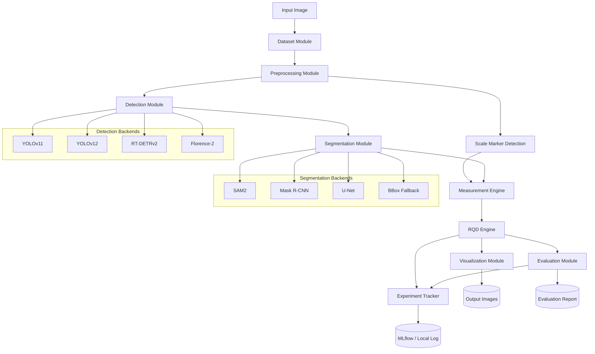

# System Architecture Specification

**Project:** rqd-ai-lab
**Phase:** 6 — Architecture Spec
**Version:** 1.0.0
**Date:** 2026-03-16
**Status:** Draft

---

## 1. Architecture Philosophy

The system follows a **modular pipeline architecture** where each stage is a distinct, independently testable module. Modules communicate through defined data contracts (see Phase 7). No module directly instantiates another module's internal classes; all coupling is through interfaces and configuration.

Design principles:
- **Single responsibility**: each module does one thing well.
- **Configuration-driven**: all behavior is parameterized via YAML.
- **Fail-fast**: invalid inputs are rejected at module boundaries, not silently propagated.
- **Observable**: every module emits structured logs and timing metrics.
- **Swappable backends**: detection and segmentation models are interchangeable via the registry pattern.

---

## 2. Module Definitions

### 2.1 Dataset Module (`src/dataset/`)

**Responsibilities:**
- Load and validate image files and annotation files.
- Apply and version dataset splits.
- Produce `ImageSample` objects for downstream modules.
- Compute dataset statistics (class distribution, image resolution distribution).

**Public Interfaces:**
```python
class DatasetLoader:
    def __init__(self, config: DatasetConfig) -> None
    def load_split(self, split: Literal["train", "val", "test"]) -> List[ImageSample]
    def validate(self) -> ValidationReport
    def stats(self) -> DatasetStats
```

**Dependencies:**
- `configs/dataset.yaml`
- Raw image files under `data/raw/`
- Annotation files under `data/annotations/`
- Split file under `data/annotations/splits/`

**Failure Modes:**
- Image file not found → `DatasetError` with file path
- Annotation parse error → `AnnotationParseError` with line number
- Split file missing → `ConfigError`
- Validation rule violation (DQ-001 to DQ-014) → logged; error-level violations raise `DataQualityError`

**Observability:**
- Log: dataset split size, class distribution, validation summary
- Metric: `dataset.num_images`, `dataset.num_annotations_per_class`

---

### 2.2 Preprocessing Module (`src/preprocessing/`)

**Responsibilities:**
- Resize, normalize, and pad images for model input.
- Record preprocessing metadata (scale factors, padding) for coordinate inversion.
- Apply training-time augmentation when configured.
- Convert between color spaces as required by model backends.

**Public Interfaces:**
```python
class Preprocessor:
    def __init__(self, config: PreprocessingConfig) -> None
    def process(self, sample: ImageSample) -> ProcessedImage
    def process_batch(self, samples: List[ImageSample]) -> List[ProcessedImage]
    def invert_coords(self, coords: np.ndarray, metadata: PreprocessMetadata) -> np.ndarray
```

**Dependencies:**
- `src/dataset/` (ImageSample type)
- `configs/dataset.yaml` (augmentation policy)

**Failure Modes:**
- Image tensor shape mismatch → `PreprocessingError`
- Invalid normalization range → `ConfigError`

**Observability:**
- Log: preprocessing config at startup; per-image resize ratio
- Metric: `preprocessing.latency_ms`

---

### 2.3 Annotation Utilities Module (`src/utils/annotation_utils.py`)

**Responsibilities:**
- Convert between annotation formats (YOLO ↔ COCO ↔ internal).
- Validate annotation geometry (bounds, sizes).
- Merge and split annotation files.
- Compute per-class statistics from annotation files.

**Public Interfaces:**
```python
def yolo_to_coco(yolo_dir: Path, output_path: Path, class_names: List[str]) -> None
def coco_to_yolo(coco_json: Path, output_dir: Path) -> None
def validate_annotations(ann: List[Annotation], image_shape: Tuple[int,int]) -> List[ValidationError]
def compute_class_distribution(annotations: List[Annotation]) -> Dict[str, int]
```

**Dependencies:** None (pure utility functions)

**Failure Modes:**
- Malformed annotation entry → `AnnotationParseError`
- Out-of-bounds coordinate → `ValidationError`

**Observability:**
- Log: annotation format conversion summary

---

### 2.4 Detection Module (`src/detection/`)

**Responsibilities:**
- Load and manage detection model backends.
- Run fragment and fracture detection inference.
- Apply confidence filtering and NMS.
- Normalize output to `DetectionResult` contract.

**Public Interfaces:**
```python
class DetectionModule:
    def __init__(self, config: DetectionConfig) -> None
    def load(self) -> None
    def detect(self, image: ProcessedImage) -> DetectionResult
    def detect_batch(self, images: List[ProcessedImage]) -> List[DetectionResult]

class DetectorRegistry:
    def register(self, name: str, backend_cls: Type[DetectorBackend]) -> None
    def get(self, name: str) -> DetectorBackend
```

**Supported backends (registered by name):**
- `"yolov11"` → `YOLOv11Backend`
- `"yolov12"` → `YOLOv12Backend`
- `"rtdetrv2"` → `RTDETRv2Backend`
- `"florence2"` → `Florence2DetectionBackend`
- `"grounding_dino"` → `GroundingDINOBackend` (optional)

**Dependencies:**
- `src/preprocessing/` (ProcessedImage type)
- Model weight files (paths from config)

**Failure Modes:**
- Unknown backend name → `RegistryError`
- Weight file not found → `ModelLoadError`
- VRAM insufficient → `ResourceError` with VRAM stats

**Observability:**
- Log: model name, weight path, device, VRAM usage at load
- Metric: `detection.latency_ms`, `detection.num_detections`, `detection.vram_peak_mb`

---

### 2.5 Segmentation Module (`src/segmentation/`)

**Responsibilities:**
- Load and manage segmentation model backends.
- Run instance segmentation using detection result prompts.
- Normalize output to `SegmentationResult` contract.
- Fall back to bounding box mode when segmentation is disabled.

**Public Interfaces:**
```python
class SegmentationModule:
    def __init__(self, config: SegmentationConfig) -> None
    def load(self) -> None
    def segment(self, image: ProcessedImage, detections: DetectionResult) -> List[SegmentationResult]

class SegmentorRegistry:
    def register(self, name: str, backend_cls: Type[SegmentorBackend]) -> None
    def get(self, name: str) -> SegmentorBackend
```

**Supported backends:**
- `"sam2"` → `SAM2Backend`
- `"mask_rcnn"` → `MaskRCNNBackend`
- `"unet"` → `UNetBackend`
- `"none"` → `BBoxFallbackBackend` (uses detection bounding box as mask)

**Dependencies:**
- `src/detection/` (DetectionResult type)
- Model weight files

**Failure Modes:**
- Segmentation model not loaded → `ModelNotLoadedError`
- Empty detection input → returns empty list (not an error)

**Observability:**
- Log: backend name, VRAM usage
- Metric: `segmentation.latency_ms`, `segmentation.mean_mask_score`

---

### 2.6 Foundation Model Module (`src/foundation_models/`)

**Responsibilities:**
- Provide a unified interface to foundation models (Florence-2, Grounding DINO).
- Translate natural language prompts to detection/segmentation outputs.
- Adapt foundation model output to the standard `DetectionResult` contract.

**Public Interfaces:**
```python
class FoundationModelModule:
    def __init__(self, config: FoundationModelConfig) -> None
    def load(self) -> None
    def detect(self, image: ProcessedImage, prompt: str) -> DetectionResult
    def describe_region(self, image: ProcessedImage, box: List[float]) -> str
```

**Dependencies:**
- Hugging Face `transformers` library
- Network access for model download (or pre-cached weights)

**Failure Modes:**
- Model not available (network/cache) → `ModelLoadError`
- Prompt produces no output → returns empty `DetectionResult` (logged as WARNING)

**Observability:**
- Log: model name, prompt text, number of detected objects
- Metric: `foundation.latency_ms`

---

### 2.7 Measurement Engine (`src/measurement/`)

**Responsibilities:**
- Extract fragment principal axis lengths from bounding boxes or segmentation masks.
- Convert pixel measurements to millimeters using calibration factor.
- Classify fragments as qualifying (≥ 100 mm) or non-qualifying.
- Produce `FragmentMeasurement` objects.

**Public Interfaces:**
```python
class MeasurementEngine:
    def __init__(self, config: MeasurementConfig) -> None
    def measure(
        self,
        detections: DetectionResult,
        segmentations: List[SegmentationResult],
        calibration: CalibrationInfo,
    ) -> List[FragmentMeasurement]

def compute_principal_axis_length(mask: np.ndarray) -> Tuple[float, float]
def bbox_to_length(bbox: List[float], orientation: Literal["horizontal","vertical"]) -> float
```

**Dependencies:**
- `src/detection/` (DetectionResult)
- `src/segmentation/` (SegmentationResult)
- Calibration factor (CalibrationInfo from preprocessing or scale detection)

**Failure Modes:**
- Missing calibration → `CalibrationError`
- Degenerate mask (zero pixels) → fragment skipped; logged as WARNING

**Observability:**
- Log: number of measured fragments, number qualifying, calibration source
- Metric: `measurement.mean_length_mm`, `measurement.num_qualifying`

---

### 2.8 RQD Engine (`src/rqd/`)

**Responsibilities:**
- Aggregate fragment measurements per tray row.
- Compute per-row RQD values.
- Compute full-image aggregate RQD.
- Produce `RQDResult` objects.

**Public Interfaces:**
```python
class RQDEngine:
    def __init__(self, config: RQDConfig) -> None
    def compute_row_rqd(
        self,
        measurements: List[FragmentMeasurement],
        row: TrayRow,
        calibration: CalibrationInfo,
    ) -> RQDResult

    def compute_image_rqd(self, row_results: List[RQDResult]) -> RQDResult
```

**Dependencies:**
- `src/measurement/` (FragmentMeasurement)
- `src/dataset/` (TrayRow metadata)

**Failure Modes:**
- Zero total run length → `RQDComputationError`
- No measurements provided → RQD = 0 with WARNING log

**Observability:**
- Log: per-row RQD, aggregate RQD
- Metric: `rqd.value`, `rqd.qualifying_length_mm`, `rqd.total_length_mm`

---

### 2.9 Evaluation Module (`src/evaluation/`)

**Responsibilities:**
- Compute detection metrics (mAP, precision, recall, F1) against ground truth.
- Compute segmentation metrics (mask IoU).
- Compute measurement metrics (MAE, RMSE of fragment lengths).
- Compute RQD metrics (absolute error, relative error).
- Produce `EvaluationReport` objects.

**Public Interfaces:**
```python
class EvaluationModule:
    def __init__(self, config: EvaluationConfig) -> None
    def evaluate_detection(
        self, predictions: List[DetectionResult], ground_truth: List[Annotation]
    ) -> DetectionMetrics

    def evaluate_segmentation(
        self, predictions: List[SegmentationResult], ground_truth: List[Annotation]
    ) -> SegmentationMetrics

    def evaluate_rqd(
        self, predictions: List[RQDResult], ground_truth: List[RQDGroundTruth]
    ) -> RQDMetrics

    def generate_report(self, run_id: str) -> EvaluationReport
```

**Dependencies:**
- `pycocotools` for detection mAP computation
- `src/rqd/` (RQDResult)

**Failure Modes:**
- Ground truth missing for an image → that image skipped; WARNING logged
- No ground truth provided → `EvaluationError`

**Observability:**
- Metric: all computed metrics logged to experiment tracker
- Log: evaluation summary table

---

### 2.10 Visualization Module (`src/visualization/`)

**Responsibilities:**
- Draw bounding boxes, segmentation masks, and labels on images.
- Annotate fragment lengths in mm.
- Overlay tray row boundaries.
- Render per-row and aggregate RQD text.
- Save annotated images to output directory.

**Public Interfaces:**
```python
class Visualizer:
    def __init__(self, config: VisualizationConfig) -> None
    def draw(
        self,
        image: np.ndarray,
        detections: DetectionResult,
        segmentations: List[SegmentationResult],
        measurements: List[FragmentMeasurement],
        rqd_results: List[RQDResult],
    ) -> np.ndarray

    def save(self, image: np.ndarray, output_path: Path) -> None
```

**Dependencies:**
- `PIL` / `cv2` for drawing
- All upstream result types

**Failure Modes:**
- Output directory not writable → `IOError`

**Observability:**
- Log: output file path written

---

### 2.11 Experiment Tracking Module (`src/utils/experiment_tracker.py`)

**Responsibilities:**
- Initialize experiment runs with unique IDs.
- Log parameters, metrics, and artifacts.
- Record configuration hashes and git commit hash.
- Provide a unified interface over MLflow (primary) or alternative backends.

**Public Interfaces:**
```python
class ExperimentTracker:
    def __init__(self, config: TrackingConfig) -> None
    def start_run(self, run_name: str) -> str   # returns run_id
    def log_params(self, params: Dict[str, Any]) -> None
    def log_metric(self, key: str, value: float, step: int | None = None) -> None
    def log_artifact(self, path: Path) -> None
    def end_run(self) -> None
```

**Dependencies:**
- `mlflow` (or alternative configured tracker)

**Failure Modes:**
- Tracking server unavailable → falls back to local file logging; WARNING logged

**Observability:**
- Self-logging: run ID and tracking URI logged at run start

---

## 3. End-to-End Pipeline Flow

```
Input Image
    │
    ▼
[Dataset Module]  ─── loads ImageSample (image + metadata)
    │
    ▼
[Preprocessing Module]  ─── normalizes, resizes → ProcessedImage + PreprocessMetadata
    │
    ├──────────────────────────────────────────┐
    ▼                                          ▼
[Detection Module]                    [Scale Marker Detection]
 └─ fragment detection                 └─ CalibrationInfo
 └─ fracture detection
    │
    ▼
[Segmentation Module]  ─── uses DetectionResult as prompts → List[SegmentationResult]
    │
    ▼
[Measurement Engine]  ─── uses SegmentationResult + CalibrationInfo → List[FragmentMeasurement]
    │
    ▼
[RQD Engine]  ─── per-row + aggregate RQD → List[RQDResult]
    │
    ├──────────────────┬────────────────────────┐
    ▼                  ▼                        ▼
[Visualization]  [Evaluation Module]   [Experiment Tracker]
 └─ annotated     └─ EvaluationReport   └─ logs all metrics
    images            (metrics)              and artifacts
    │
    ▼
Output (annotated images, CSV/JSON results, evaluation report)
```

---

## 4. Architecture Diagram (Mermaid)



---

## 5. Configuration Strategy

All runtime behavior is controlled by YAML configuration files under `configs/`.

| Config File              | Scope                                                    |
|--------------------------|----------------------------------------------------------|
| `configs/dataset.yaml`   | Data paths, split file, augmentation policy, label names |
| `configs/yolo_train.yaml`| YOLOv11/v12 training hyperparameters                    |
| `configs/rtdetr_train.yaml` | RT-DETRv2 training hyperparameters                   |
| `configs/segmentation.yaml` | Segmentation backend selection and hyperparameters   |
| `configs/evaluation.yaml`| Metric selection, IoU thresholds, output paths           |
| `configs/experiment.yaml`| Experiment name, seed, tracking URI, artifact directory  |

Config files are validated at startup against a Pydantic schema. Missing required keys raise `ConfigError` immediately.

---

## 6. Environment Strategy

| Environment     | Purpose                                    | Notes                                      |
|-----------------|--------------------------------------------|--------------------------------------------|
| `environment.yml` | Conda environment (primary)              | Pin all dependencies with exact versions   |
| `requirements.txt` | pip-installable dependencies            | Subset of conda env; used in CI            |
| `pyproject.toml` | Package metadata and dev dependencies    | Editable install: `pip install -e .[dev]`  |

Python version: 3.11 (required)
CUDA version: 11.8 or 12.1 (configurable via conda channel)

---

## 7. CLI Command Map

| Command                         | Module(s) Invoked                                     | Output                                     |
|---------------------------------|-------------------------------------------------------|--------------------------------------------|
| `rqd ingest --config ...`       | DatasetModule                                         | Validated dataset summary                  |
| `rqd preprocess --config ...`   | PreprocessingModule                                   | Processed images under `data/processed/`  |
| `rqd train --config ...`        | DatasetModule, DetectionModule or SegmentationModule  | Model checkpoint, training metrics         |
| `rqd infer --config ...`        | All pipeline modules                                  | DetectionResult, SegmentationResult, RQDResult |
| `rqd evaluate --config ...`     | EvaluationModule, ExperimentTracker                   | EvaluationReport (Markdown + CSV)          |
| `rqd compute-rqd --config ...`  | MeasurementEngine, RQDEngine                          | RQD result CSV, visualization images       |
| `rqd report --config ...`       | EvaluationModule, Visualizer                          | Full benchmark report                      |
| `rqd validate-data --config ...`| DatasetModule                                         | Validation report listing DQ violations    |
